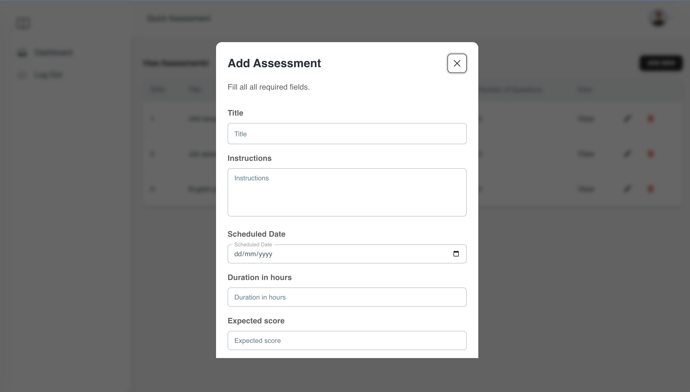

# Exam Portal

## Summary

This React project comsumes APIs from this  Laravel [repository](https://github.com/antoHero/exam-assessment-api). Clone the repository before you proceed.

### Features of the this project
- Basic authentication
- Authenticated admins can create exam, questions, and add options.
- Authenticated non-admins can view assessments, take exams, and view their scores for each assessment.
- Error handling for form validation, successful responses, and server errors
- Service classes to handle all http requests
- Axios configuration with interceptors so auth token wont need to be passed on subsequent requests

## This project was built with
- TypeScript
- React
- Tailwind CSS
- Lavarel Exam API Endpoint described above
- ESLint
- NPM
- Redux
- Toastify
- Axios
- React Hook Form
- Vite

## Prerequisites
- Web browser (Chrome recommended)
- Node.js installed

## Getting Started
Clone the project to your local machine. In the project directory, you can run:

> `npm install` to install dependencies

> `npm run dev` to serve your project on localhost:5173

## Screenshots

Login screen

User completed assessment

View all exams admin

Create an exam dialog

Edit an exam dialog

Delete an exam dialog warning

View single exam

View single exam question

👨‍💻 **Akoke Victor Anto**

- Github: [antoHero](https://github.com/antoHero)
- Twitter: [@iam_veecktor](https://twitter.com/Iam_veecktor)
- Linkedin: [Akoke Victor Anto](https://www.linkedin.com/in/akoke-anto/)
